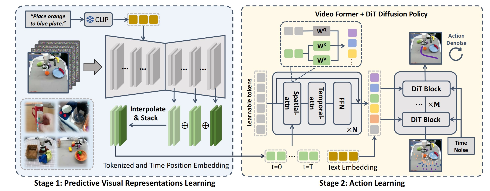

<div align="center">
<h2><center>👉 Video Prediction Policy: 

A Generalist Robot Policy with Predictive Visual Representations </h2>


[Yucheng Hu*](https://github.com/Hu-Yuch), [Yanjiang Guo*](https://robert-gyj.github.io),  [Pengchao Wang](), [Xiaoyu Chen](https://cospui.github.io), [Yen-Jen Wang](https://wangyenjen.github.io), [Jianke Zhang](https://scholar.google.com/citations?hl=zh-CN&user=6is33pIAAAAJ), [Koushil Sreenath](https://me.berkeley.edu/people/koushil-sreenath/), [Chaochao Lu](https://causallu.com), [Jianyu Chen](http://people.iiis.tsinghua.edu.cn/~jychen/)

 \*Equal contributin; Project co-lead 

 Tsinghua University, UC Berkeley, RobotEra, Shanghai AI Lab, Shanghai Qi Zhi Institute


<a href='https://arxiv.org/abs/2412.14803'></a> 
<a href='https://video-prediction-policy.github.io'></a> 

</div>

<!--  -->
<p>
    
    <!-- 
     -->
</p>

This repo is the official PyTorch implementation for ICML Spotlight paper [**Video Prediction Policy**](https://arxiv.org/abs/2412.14803).


##  Project Overview 

**Stong performance:** 

(1) Simualtion: Achieve **Avg.Len of 4.33 on Calvin abc benchmarks** 

(2) Real-world: solves **100+** tasks in real-world detexterous hand manipualtion tasks with **a single vpp policy**. 

**VPP manily contains two part:**

(1) Video prediction model training: Finetuning a general-purpose video foundation model into manipualtion-focused text-guided video prediction model. The main function entry is at `step1_prepare_latent_data.py` and `step1_train_svd.py`.

(2) Action model training: Learning implicit inverse dynamics models conditioned on the representations inside video prediction models with diffusion transformer policy. The main function entry is at `step2_train_action_calvin.py` or `step2_train_action_xbot.py`.

## Installation 🛠️
```bash
conda create -n vpp python==3.10
conda activate vpp

# Install calvin as described in (https://github.com/mees/calvin). 
# Maybe you will occur some render issues and you can refer to calvin repo to solve them.
# You can skip calvin if you do not want to perform experiments on calvin
git clone --recurse-submodules https://github.com/mees/calvin.git
$ export CALVIN_ROOT=$(pwd)/calvin
cd $CALVIN_ROOT
sh install.sh

# Then install vpp requirements
cd ..
pip install -r requirements.txt

# tips: calvin requires torch==1.13, but it also works with torch> 2.0, just ignore the warning
```


## CheckPoints 📷


| Ckpt name     | Training type | Size |
|---------------|------------------|---------|
| [clip-vit-base-patch32](https://huggingface.co/openai/clip-vit-base-patch32)  | CLIP text encoder, freezed during training        |  ~600M   |
| [svd-robot](https://huggingface.co/yjguo/svd-robot/tree/main)  | SVD video model finetuned on sthv2，openx and xhand        | ~8G    |
| [svd-robot-calvin](https://huggingface.co/yjguo/svd-robot-calvin-ft/tree/main) |   SVD video model finetuned on sthv2, openx and calvin abc video    | ~8G   |
| [dp-calvin](https://huggingface.co/yjguo/dp-calvin/tree/main) |   Action model trained on annoted calvin abc dataset    |  ~1G  |


**📊 Try Predictions on sthv2, bridge or rt-1:** If you want to make predictions on these datasets, download the svd-robot model.

**📊 Replicate results on calvin abc:** If you want to replicate results on calvin abc, download the svd-robot-calvin model.

**📊  Train VPP in cunstom environments**: If you want to run VPP algorithm on your own robot, download the svd-robot model and follow instructions in the training section.


## Reproducing the results in paper 📊
### 📊 Rollout on calvin abc benchmark
First, you need to follow instructions in the [officail calvin repo](https://github.com/mees/calvin) to install the calvin environments and download official calvin ABC-D dataset(about 500 G).

Next, download the [svd-robot-calvin](https://huggingface.co/yjguo/svd-robot-calvin-ft/tree/main) video model and [dp-calvin](https://huggingface.co/yjguo/dp-calvin/tree/main) action model. Set the video_model_folder and action_model_folder to the folder where you save the model.

```bash
python policy_evaluation/calvin_evaluate.py --video_model_path ${path to svd-robot-calvin} --action_model_folder ${path to dp-calvin} --clip_model_path ${path to clip} --calvin_abc_dir ${path to calvin dataset} 
```


### 📊 Make video predictions on datasets
You can also try video predictions with [svd-robot](https://huggingface.co/yjguo/svd-robot/tree/main) model finetuned on something-somthing-v2 datasets, Bridge,  RT-1 and RobotEra xhand. Some dataset examples are provided in the folder `video_dataset_instance` and you can direct run:

```bash
python make_prediction.py --eval --config video_conf/val_svd.yaml --video_model_path ${path to svd-robot} --clip_model_path ${path to clip} --val_dataset_dir video_dataset_instance/xhand --val_idx 0+50+100+150
```

You can try more video predictions with samples in video_dataset_instance.
`val_dataset_dir` is the root to datasets and `val_idx` is the sample index. The generated video is save in the folder`video_output`. 


## Trainning Video Prediction Policy on Calvin

### 🛸 Training requirements
Our experiments are run on one node with 8 A800/H100 cards.

### 🛸 Stage 1: Training video model
(1) Since the video diffusion model are run in latent space of image encoder, we need to first extract the latent sapce of the video. This process will save GPU memory cost and reduce training time. Run `step1_prepare_latent_data.py` to prepare latent. The dataset format should be similar to `video_dataset_instance`. 

We have extract features for something-something-v2, bridge, rt1 and calvin, and you can directly download them from [huggingface dataset:vpp_svd_latent](https://huggingface.co/datasets/yjguo/vpp_svd_latent/tree/main)

(2) After prepare the latent, you need to reset the following parameters in `video_conf/train_svd.yaml`: `dataset_dir` is the root path of datasets; `dataset` is different video dataset used for finetuning and connected with `+`; `prob` is the sample ratio of each dataset. 

```bash
accelerate launch --main_process_port 29506 step1_train_svd.py --config video_conf/train_calvin_svd.yaml --pretrained_model_path ${path to svd-robot}
```


### 🛸 Stage 2: Training action model

Important: We highly encourage you to **check the video prediction results** before policy learning, since the policy performance are highly depand on the video prediction quality. Some samples are automatically saved during training. You can also make more predcitions following the instructions in the video prediction section.

Set the argument `video_model_path` to the video model you finetuned, the argument `root_data_dir` to where Calvin-ABC dataset located, the argument `text_encoder_path` to path to clip-vit-base-patch32 

```bash
accelerate launch step2_train_action_calvin.py --root_data_dir ${path to Calvin dataset} --video_model_path ${path to video model} --text_encoder_path ${path to clip}
```

## Trainning Video Prediction Policy on Custom environments
The proccess is similar to train VPP on calvin benchamrks. Additionally, we provide the following files which we used to train VPP on real-world RobotEra x-bot/x-hand robot:

`step2_prepare_json.py`: you can use it to merge the annotation and caculate the mean/std of state/action on your real robot demonstrations.

`policy_models/datasets/xbot_dataset.py`: dataset

`policy_models/VPP_policy_xbot.py`: action model

`policy_conf/VPP_xbot_train.yaml`: training config

`step2_train_action_xbot.py`: main_training_entrance

`step3_deploy_real_xbot.py`: agent for deploy

## Acknowledgement

Video prediction policy is developed from the opensourced video foundation model [Stable-Video-Diffusion](https://github.com/Stability-AI/generative-models) and diffusion transformer policy [MDT](https://github.com/intuitive-robots/mdt_policy). We thank the authors for their efforts!


## Bibtex 
If you find our work helpful, please leave us a star and cite our paper. Thank you!
```
@article{hu2024video,
  title={Video Prediction Policy: A Generalist Robot Policy with Predictive Visual Representations},
  author={Hu, Yucheng and Guo, Yanjiang and Wang, Pengchao and Chen, Xiaoyu and Wang, Yen-Jen and Zhang, Jianke and Sreenath, Koushil and Lu, Chaochao and Chen, Jianyu},
  journal={arXiv preprint arXiv:2412.14803},
  year={2024}
}
